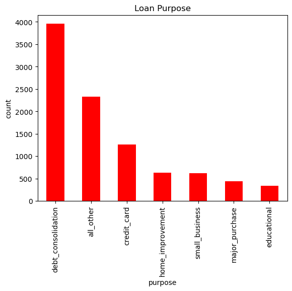
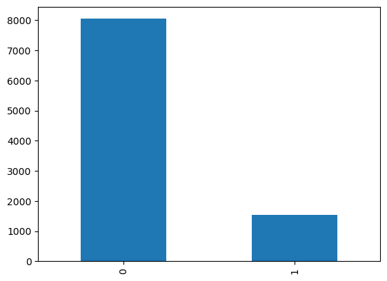
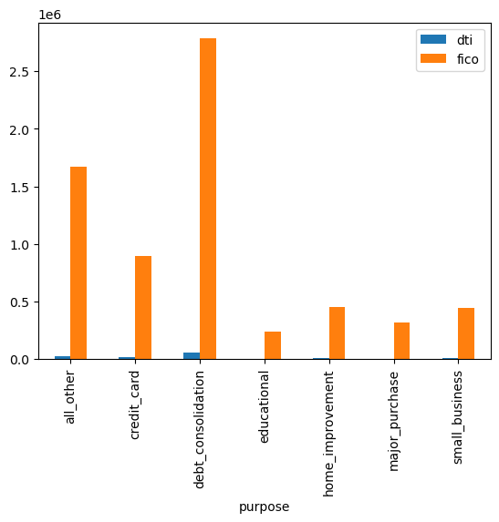

```python
#importing important libaries
import pandas as pd
import numpy as np
import matplotlib.pyplot as plt
from sklearn.preprocessing import LabelEncoder
from sklearn.preprocessing import OneHotEncoder
from sklearn.preprocessing  import MinMaxScaler
from sklearn.tree import DecisionTreeClassifier


#loading a dataset
df = pd.read_excel(r"C:\Users\ritik\Downloads\loan dataset.xlsx")
```


```python
# Preprocessing 
df.head()
```


<div>
<style scoped>
    .dataframe tbody tr th:only-of-type {
        vertical-align: middle;
    }

    .dataframe tbody tr th {
        vertical-align: top;
    }

    .dataframe thead th {
        text-align: right;
    }
</style>
<table border="1" class="dataframe">
  <thead>
    <tr style="text-align: right;">
      <th></th>
      <th>credit.policy</th>
      <th>purpose</th>
      <th>int.rate</th>
      <th>installment</th>
      <th>log.annual.inc</th>
      <th>dti</th>
      <th>fico</th>
      <th>days.with.cr.line</th>
      <th>revol.bal</th>
      <th>revol.util</th>
      <th>inq.last.6mths</th>
      <th>delinq.2yrs</th>
      <th>pub.rec</th>
      <th>not.fully.paid</th>
    </tr>
  </thead>
  <tbody>
    <tr>
      <th>0</th>
      <td>1</td>
      <td>debt_consolidation</td>
      <td>0.1189</td>
      <td>829.10</td>
      <td>11.350407</td>
      <td>19.48</td>
      <td>737</td>
      <td>5639.958333</td>
      <td>28854</td>
      <td>52.1</td>
      <td>0</td>
      <td>0</td>
      <td>0</td>
      <td>0</td>
    </tr>
    <tr>
      <th>1</th>
      <td>1</td>
      <td>credit_card</td>
      <td>0.1071</td>
      <td>228.22</td>
      <td>11.082143</td>
      <td>14.29</td>
      <td>707</td>
      <td>2760.000000</td>
      <td>33623</td>
      <td>76.7</td>
      <td>0</td>
      <td>0</td>
      <td>0</td>
      <td>0</td>
    </tr>
    <tr>
      <th>2</th>
      <td>1</td>
      <td>debt_consolidation</td>
      <td>0.1357</td>
      <td>366.86</td>
      <td>10.373491</td>
      <td>11.63</td>
      <td>682</td>
      <td>4710.000000</td>
      <td>3511</td>
      <td>25.6</td>
      <td>1</td>
      <td>0</td>
      <td>0</td>
      <td>0</td>
    </tr>
    <tr>
      <th>3</th>
      <td>1</td>
      <td>debt_consolidation</td>
      <td>0.1008</td>
      <td>162.34</td>
      <td>11.350407</td>
      <td>8.10</td>
      <td>712</td>
      <td>2699.958333</td>
      <td>33667</td>
      <td>73.2</td>
      <td>1</td>
      <td>0</td>
      <td>0</td>
      <td>0</td>
    </tr>
    <tr>
      <th>4</th>
      <td>1</td>
      <td>credit_card</td>
      <td>0.1426</td>
      <td>102.92</td>
      <td>11.299732</td>
      <td>14.97</td>
      <td>667</td>
      <td>4066.000000</td>
      <td>4740</td>
      <td>39.5</td>
      <td>0</td>
      <td>1</td>
      <td>0</td>
      <td>0</td>
    </tr>
  </tbody>
</table>
</div>


```python
df.tail()

```


<div>
<style scoped>
    .dataframe tbody tr th:only-of-type {
        vertical-align: middle;
    }

    .dataframe tbody tr th {
        vertical-align: top;
    }

    .dataframe thead th {
        text-align: right;
    }
</style>
<table border="1" class="dataframe">
  <thead>
    <tr style="text-align: right;">
      <th></th>
      <th>credit.policy</th>
      <th>purpose</th>
      <th>int.rate</th>
      <th>installment</th>
      <th>log.annual.inc</th>
      <th>dti</th>
      <th>fico</th>
      <th>days.with.cr.line</th>
      <th>revol.bal</th>
      <th>revol.util</th>
      <th>inq.last.6mths</th>
      <th>delinq.2yrs</th>
      <th>pub.rec</th>
      <th>not.fully.paid</th>
    </tr>
  </thead>
  <tbody>
    <tr>
      <th>9573</th>
      <td>0</td>
      <td>all_other</td>
      <td>0.1461</td>
      <td>344.76</td>
      <td>12.180755</td>
      <td>10.39</td>
      <td>672</td>
      <td>10474.000000</td>
      <td>215372</td>
      <td>82.1</td>
      <td>2</td>
      <td>0</td>
      <td>0</td>
      <td>1</td>
    </tr>
    <tr>
      <th>9574</th>
      <td>0</td>
      <td>all_other</td>
      <td>0.1253</td>
      <td>257.70</td>
      <td>11.141862</td>
      <td>0.21</td>
      <td>722</td>
      <td>4380.000000</td>
      <td>184</td>
      <td>1.1</td>
      <td>5</td>
      <td>0</td>
      <td>0</td>
      <td>1</td>
    </tr>
    <tr>
      <th>9575</th>
      <td>0</td>
      <td>debt_consolidation</td>
      <td>0.1071</td>
      <td>97.81</td>
      <td>10.596635</td>
      <td>13.09</td>
      <td>687</td>
      <td>3450.041667</td>
      <td>10036</td>
      <td>82.9</td>
      <td>8</td>
      <td>0</td>
      <td>0</td>
      <td>1</td>
    </tr>
    <tr>
      <th>9576</th>
      <td>0</td>
      <td>home_improvement</td>
      <td>0.1600</td>
      <td>351.58</td>
      <td>10.819778</td>
      <td>19.18</td>
      <td>692</td>
      <td>1800.000000</td>
      <td>0</td>
      <td>3.2</td>
      <td>5</td>
      <td>0</td>
      <td>0</td>
      <td>1</td>
    </tr>
    <tr>
      <th>9577</th>
      <td>0</td>
      <td>debt_consolidation</td>
      <td>0.1392</td>
      <td>853.43</td>
      <td>11.264464</td>
      <td>16.28</td>
      <td>732</td>
      <td>4740.000000</td>
      <td>37879</td>
      <td>57.0</td>
      <td>6</td>
      <td>0</td>
      <td>0</td>
      <td>1</td>
    </tr>
  </tbody>
</table>
</div>


```python
df.index
```


    RangeIndex(start=0, stop=9578, step=1)


```python
df.info()
```

    <class 'pandas.core.frame.DataFrame'>
    RangeIndex: 9578 entries, 0 to 9577
    Data columns (total 14 columns):
     #   Column             Non-Null Count  Dtype  
    ---  ------             --------------  -----  
     0   credit.policy      9578 non-null   int64  
     1   purpose            9578 non-null   object 
     2   int.rate           9578 non-null   float64
     3   installment        9578 non-null   float64
     4   log.annual.inc     9578 non-null   float64
     5   dti                9578 non-null   float64
     6   fico               9578 non-null   int64  
     7   days.with.cr.line  9578 non-null   float64
     8   revol.bal          9578 non-null   int64  
     9   revol.util         9578 non-null   float64
     10  inq.last.6mths     9578 non-null   int64  
     11  delinq.2yrs        9578 non-null   int64  
     12  pub.rec            9578 non-null   int64  
     13  not.fully.paid     9578 non-null   int64  
    dtypes: float64(6), int64(7), object(1)
    memory usage: 1.0+ MB
    


```python
df.isnull().sum()
```


    credit.policy        0
    purpose              0
    int.rate             0
    installment          0
    log.annual.inc       0
    dti                  0
    fico                 0
    days.with.cr.line    0
    revol.bal            0
    revol.util           0
    inq.last.6mths       0
    delinq.2yrs          0
    pub.rec              0
    not.fully.paid       0
    dtype: int64


```python
df.columns
```


    Index(['credit.policy', 'purpose', 'int.rate', 'installment', 'log.annual.inc',
           'dti', 'fico', 'days.with.cr.line', 'revol.bal', 'revol.util',
           'inq.last.6mths', 'delinq.2yrs', 'pub.rec', 'not.fully.paid'],
          dtype='object')


```python
df.describe()
```


<div>
<style scoped>
    .dataframe tbody tr th:only-of-type {
        vertical-align: middle;
    }

    .dataframe tbody tr th {
        vertical-align: top;
    }

    .dataframe thead th {
        text-align: right;
    }
</style>
<table border="1" class="dataframe">
  <thead>
    <tr style="text-align: right;">
      <th></th>
      <th>credit.policy</th>
      <th>int.rate</th>
      <th>installment</th>
      <th>log.annual.inc</th>
      <th>dti</th>
      <th>fico</th>
      <th>days.with.cr.line</th>
      <th>revol.bal</th>
      <th>revol.util</th>
      <th>inq.last.6mths</th>
      <th>delinq.2yrs</th>
      <th>pub.rec</th>
      <th>not.fully.paid</th>
    </tr>
  </thead>
  <tbody>
    <tr>
      <th>count</th>
      <td>9578.000000</td>
      <td>9578.000000</td>
      <td>9578.000000</td>
      <td>9578.000000</td>
      <td>9578.000000</td>
      <td>9578.000000</td>
      <td>9578.000000</td>
      <td>9.578000e+03</td>
      <td>9578.000000</td>
      <td>9578.000000</td>
      <td>9578.000000</td>
      <td>9578.000000</td>
      <td>9578.000000</td>
    </tr>
    <tr>
      <th>mean</th>
      <td>0.804970</td>
      <td>0.122640</td>
      <td>319.089413</td>
      <td>10.932117</td>
      <td>12.606679</td>
      <td>710.846314</td>
      <td>4560.767197</td>
      <td>1.691396e+04</td>
      <td>46.799236</td>
      <td>1.577469</td>
      <td>0.163708</td>
      <td>0.062122</td>
      <td>0.160054</td>
    </tr>
    <tr>
      <th>std</th>
      <td>0.396245</td>
      <td>0.026847</td>
      <td>207.071301</td>
      <td>0.614813</td>
      <td>6.883970</td>
      <td>37.970537</td>
      <td>2496.930377</td>
      <td>3.375619e+04</td>
      <td>29.014417</td>
      <td>2.200245</td>
      <td>0.546215</td>
      <td>0.262126</td>
      <td>0.366676</td>
    </tr>
    <tr>
      <th>min</th>
      <td>0.000000</td>
      <td>0.060000</td>
      <td>15.670000</td>
      <td>7.547502</td>
      <td>0.000000</td>
      <td>612.000000</td>
      <td>178.958333</td>
      <td>0.000000e+00</td>
      <td>0.000000</td>
      <td>0.000000</td>
      <td>0.000000</td>
      <td>0.000000</td>
      <td>0.000000</td>
    </tr>
    <tr>
      <th>25%</th>
      <td>1.000000</td>
      <td>0.103900</td>
      <td>163.770000</td>
      <td>10.558414</td>
      <td>7.212500</td>
      <td>682.000000</td>
      <td>2820.000000</td>
      <td>3.187000e+03</td>
      <td>22.600000</td>
      <td>0.000000</td>
      <td>0.000000</td>
      <td>0.000000</td>
      <td>0.000000</td>
    </tr>
    <tr>
      <th>50%</th>
      <td>1.000000</td>
      <td>0.122100</td>
      <td>268.950000</td>
      <td>10.928884</td>
      <td>12.665000</td>
      <td>707.000000</td>
      <td>4139.958333</td>
      <td>8.596000e+03</td>
      <td>46.300000</td>
      <td>1.000000</td>
      <td>0.000000</td>
      <td>0.000000</td>
      <td>0.000000</td>
    </tr>
    <tr>
      <th>75%</th>
      <td>1.000000</td>
      <td>0.140700</td>
      <td>432.762500</td>
      <td>11.291293</td>
      <td>17.950000</td>
      <td>737.000000</td>
      <td>5730.000000</td>
      <td>1.824950e+04</td>
      <td>70.900000</td>
      <td>2.000000</td>
      <td>0.000000</td>
      <td>0.000000</td>
      <td>0.000000</td>
    </tr>
    <tr>
      <th>max</th>
      <td>1.000000</td>
      <td>0.216400</td>
      <td>940.140000</td>
      <td>14.528354</td>
      <td>29.960000</td>
      <td>827.000000</td>
      <td>17639.958330</td>
      <td>1.207359e+06</td>
      <td>119.000000</td>
      <td>33.000000</td>
      <td>13.000000</td>
      <td>5.000000</td>
      <td>1.000000</td>
    </tr>
  </tbody>
</table>
</div>


```python
df.shape
```


    (9578, 14)


```python

df['purpose'].value_counts()

```


    debt_consolidation    3957
    all_other             2331
    credit_card           1262
    home_improvement       629
    small_business         619
    major_purchase         437
    educational            343
    Name: purpose, dtype: int64


```python
df['purpose'].value_counts().plot(kind='bar' , color ='red' , xlabel= 'purpose', ylabel='count', title="Loan Purpose")
```


    <Axes: title={'center': 'Loan Purpose'}, xlabel='purpose', ylabel='count'>


    

    


```python
for i in df.fico.unique():
    print("--------------------------------")
    print(i)
    print(df.loc[df['fico']==i ,'purpose':'fico'])
```

    --------------------------------
    737
                     purpose  int.rate  installment  log.annual.inc    dti  fico
    0     debt_consolidation    0.1189       829.10       11.350407  19.48   737
    84      home_improvement    0.0870        94.98       11.034890  12.23   737
    89        small_business    0.0964       642.02       11.472103   2.86   737
    148            all_other    0.0964       169.32       11.156251  17.57   737
    152            all_other    0.1059       162.73        9.615805  24.40   737
    ...                  ...       ...          ...             ...    ...   ...
    9444           all_other    0.1218       299.70        9.980449   6.17   737
    9466           all_other    0.1287       622.22       11.260611  18.24   737
    9500  debt_consolidation    0.1218       666.00       11.617285  11.78   737
    9518  debt_consolidation    0.1062       390.72       11.589887  13.68   737
    9536      small_business    0.1348       542.79       12.611538   3.12   737
    
    [313 rows x 6 columns]
    --------------------------------
    707
                     purpose  int.rate  installment  log.annual.inc    dti  fico
    1            credit_card    0.1071       228.22       11.082143  14.29   707
    9     debt_consolidation    0.1221        84.12       10.203592  10.00   707
    38    debt_consolidation    0.0996       161.25       10.778956   8.03   707
    68    debt_consolidation    0.1375       340.57       10.463103  17.38   707
    79             all_other    0.1091       130.79        9.798127  18.00   707
    ...                  ...       ...          ...             ...    ...   ...
    9505         educational    0.1287       121.08       10.085809   3.40   707
    9528           all_other    0.1062       146.52       10.621327   7.02   707
    9533  debt_consolidation    0.1533       870.71       11.856515  23.82   707
    9551    home_improvement    0.1348       508.87       11.736069  16.85   707
    9554      small_business    0.1533       870.71       11.842229  16.16   707
    
    [444 rows x 6 columns]
    --------------------------------
    682
                     purpose  int.rate  installment  log.annual.inc    dti  fico
    2     debt_consolidation    0.1357       366.86       10.373491  11.63   682
    8       home_improvement    0.1134        87.19       11.407565  17.25   682
    57           credit_card    0.1343       678.08       11.884489  10.15   682
    58           credit_card    0.1249       401.37       11.225243  15.00   682
    60    debt_consolidation    0.1186       397.75       11.082143   7.14   682
    ...                  ...       ...          ...             ...    ...   ...
    9493      major_purchase    0.1392       136.55       10.341742  13.24   682
    9522         credit_card    0.1533       362.22       11.127263  24.78   682
    9525           all_other    0.1311       134.98       10.295530   2.35   682
    9544  debt_consolidation    0.1348       271.40       11.198215  12.44   682
    9558  debt_consolidation    0.1533       696.57       11.805595  17.21   682
    
    [536 rows x 6 columns]
    --------------------------------
    712
                     purpose  int.rate  installment  log.annual.inc    dti  fico
    3     debt_consolidation    0.1008       162.34       11.350407   8.10   712
    18    debt_consolidation    0.1039       584.12       10.491274   3.80   712
    25             all_other    0.0901       159.03       12.429216  10.00   712
    51        small_business    0.1028       323.98       10.217422  10.70   712
    53           educational    0.0996       112.87        9.510445  16.44   712
    ...                  ...       ...          ...             ...    ...   ...
    9440  debt_consolidation    0.1670       284.02       10.778956   0.72   712
    9452         credit_card    0.1670       511.22       10.915088  16.97   712
    9494         credit_card    0.1183       480.45       11.407565  17.81   712
    9511  debt_consolidation    0.1357       679.37       10.308953   9.44   712
    9539      small_business    0.1533       870.71       11.849398  23.81   712
    
    [395 rows x 6 columns]
    --------------------------------
    667
                     purpose  int.rate  installment  log.annual.inc    dti  fico
    4            credit_card    0.1426       102.92       11.299732  14.97   667
    6     debt_consolidation    0.1496       194.02       10.714418   4.00   667
    19        major_purchase    0.1513       173.65       11.002100   2.74   667
    63    debt_consolidation    0.1186        99.44       10.495515   7.47   667
    86           credit_card    0.1533       444.05       11.002100  19.52   667
    ...                  ...       ...          ...             ...    ...   ...
    9547         educational    0.1607       147.82        9.862666  16.19   667
    9548    home_improvement    0.1607        87.99       10.778956  14.20   667
    9549    home_improvement    0.2164       729.70       11.877569   8.63   667
    9560           all_other    0.1867       547.36       11.407565  15.76   667
    9568           all_other    0.1979        37.06       10.645425  22.17   667
    
    [438 rows x 6 columns]
    --------------------------------
    727
                     purpose  int.rate  installment  log.annual.inc    dti  fico
    5            credit_card    0.0788       125.13       11.904968  16.98   727
    14    debt_consolidation    0.0863       209.54        9.487972   9.73   727
    96    debt_consolidation    0.1154       329.95       12.323856  20.00   727
    155   debt_consolidation    0.0996       158.83       11.338572   4.84   727
    169          credit_card    0.0996       643.36       11.661345  13.07   727
    ...                  ...       ...          ...             ...    ...   ...
    9465           all_other    0.0894        54.02        9.655026  24.15   727
    9508  debt_consolidation    0.1218       466.20       10.736310   5.32   727
    9512           all_other    0.1218       199.80       10.404263   4.51   727
    9516  debt_consolidation    0.0988       233.53       11.736069   7.97   727
    9563  debt_consolidation    0.1099       556.50       11.225243  17.84   727
    
    [361 rows x 6 columns]
    --------------------------------
    722
                     purpose  int.rate  installment  log.annual.inc    dti  fico
    7              all_other    0.1114       131.22       11.002100  11.08   722
    48           credit_card    0.0901       159.03       11.198215   9.96   722
    72    debt_consolidation    0.0996       257.99       10.778956  15.13   722
    83             all_other    0.0964       128.41       11.512925  15.00   722
    109   debt_consolidation    0.1028       323.99       11.695247  14.40   722
    ...                  ...       ...          ...             ...    ...   ...
    9530         credit_card    0.1099       425.56       11.571194  16.36   722
    9557         credit_card    0.1025       466.35       12.206073  13.97   722
    9561           all_other    0.0788       115.74       10.999095  10.17   722
    9569    home_improvement    0.1426       823.34       12.429216   3.62   722
    9574           all_other    0.1253       257.70       11.141862   0.21   722
    
    [388 rows x 6 columns]
    --------------------------------
    677
                     purpose  int.rate  installment  log.annual.inc    dti  fico
    10    debt_consolidation    0.1347       360.43       10.434116  22.09   677
    43      home_improvement    0.1028        97.20       12.206073   0.00   677
    73        small_business    0.1501       225.37       12.269047   6.45   677
    118   debt_consolidation    0.1375       263.09       11.038110   9.80   677
    139          credit_card    0.0996        38.70       10.373491   1.13   677
    ...                  ...       ...          ...             ...    ...   ...
    9484           all_other    0.1774        86.46       10.819778  12.02   677
    9515           all_other    0.1607       281.56       11.225243  20.56   677
    9531      major_purchase    0.2017       149.01       10.596635  12.39   677
    9556  debt_consolidation    0.1385       136.42       11.002100  18.18   677
    9571           all_other    0.1568       161.01       11.225243   8.00   677
    
    [427 rows x 6 columns]
    --------------------------------
    662
                     purpose  int.rate  installment  log.annual.inc    dti  fico
    11    debt_consolidation    0.1324       253.58       11.835009   9.16   662
    22           credit_card    0.1355       339.60       11.512925   7.94   662
    27    debt_consolidation    0.1375       255.43        9.998798  14.29   662
    56           credit_card    0.1154        39.60        9.903488   2.04   662
    85    debt_consolidation    0.1217       179.80       10.463103   7.10   662
    ...                  ...       ...          ...             ...    ...   ...
    9521  debt_consolidation    0.1843       691.03       11.127263  20.12   662
    9524         credit_card    0.1947       922.42       11.561716  19.81   662
    9546  debt_consolidation    0.1570       262.59       10.668955  21.35   662
    9566           all_other    0.2164       551.08       11.002100  24.06   662
    9572  debt_consolidation    0.1565        69.98       10.110472   7.02   662
    
    [414 rows x 6 columns]
    --------------------------------
    767
                     purpose  int.rate  installment  log.annual.inc    dti  fico
    12    debt_consolidation    0.0859       316.11       10.933107  15.49   767
    92    debt_consolidation    0.0870       383.87       11.918391   4.80   767
    133            all_other    0.1028       138.51       10.341742  24.81   767
    161            all_other    0.1059       269.31       11.599103  24.01   767
    178          educational    0.0775       156.11       10.858999   9.55   767
    ...                  ...       ...          ...             ...    ...   ...
    8717           all_other    0.0800       141.02       10.166006   1.43   767
    8932           all_other    0.0963       385.14       11.289782   7.41   767
    9176  debt_consolidation    0.1183       497.01       12.154758  16.26   767
    9229      small_business    0.1496       623.61       12.611538  16.76   767
    9458    home_improvement    0.1739       537.71       10.915088   5.78   767
    
    [142 rows x 6 columns]
    --------------------------------
    747
                   purpose  int.rate  installment  log.annual.inc    dti  fico
    13      small_business    0.0714        92.82       11.512925   6.50   747
    55      small_business    0.1059       398.69       11.002100  17.12   747
    87           all_other    0.0775       124.89       11.031659   3.46   747
    116        credit_card    0.1122       295.59       10.385914  22.15   747
    171        educational    0.0901       572.48       10.621327  15.37   747
    ...                ...       ...          ...             ...    ...   ...
    8106  home_improvement    0.1109       688.41       12.301383  21.28   747
    8438       educational    0.0800        15.67        8.101678   0.00   747
    8549         all_other    0.0832        15.75       11.512925  14.02   747
    8556         all_other    0.1261       308.26       11.461948  27.40   747
    9461         all_other    0.0894       444.81       11.225243  20.18   747
    
    [236 rows x 6 columns]
    --------------------------------
    702
                     purpose  int.rate  installment  log.annual.inc    dti  fico
    15        major_purchase    0.1103       327.53       10.738915  13.04   702
    44           credit_card    0.1122       164.23       10.308953  18.64   702
    66             all_other    0.0996       112.87       11.264464  11.06   702
    93           credit_card    0.1122       217.60       11.385092  18.00   702
    102       small_business    0.1501        73.68       11.472103  16.89   702
    ...                  ...       ...          ...             ...    ...   ...
    9514           all_other    0.1136       213.93       10.734220   2.43   702
    9527           all_other    0.1570       840.26       12.180755  11.42   702
    9532  debt_consolidation    0.1273       335.67       10.404263  19.05   702
    9542           all_other    0.1348       468.16       10.972877  15.16   702
    9552  debt_consolidation    0.1311       337.45       10.691945  23.62   702
    
    [472 rows x 6 columns]
    --------------------------------
    672
                     purpose  int.rate  installment  log.annual.inc    dti  fico
    16             all_other    0.1317        77.69       10.522773   2.26   672
    24    debt_consolidation    0.1229       320.19       11.264464   8.80   672
    37           credit_card    0.1122       164.23       11.289782   1.21   672
    90        small_business    0.1154       104.76        9.615805  12.24   672
    106          credit_card    0.1217       266.37       11.156251  10.20   672
    ...                  ...       ...          ...             ...    ...   ...
    9474           all_other    0.1913       110.17        9.980449   5.33   672
    9485      major_purchase    0.1704       231.89       11.156251  20.81   672
    9537  debt_consolidation    0.1607       114.38       10.649986  16.64   672
    9570           all_other    0.1671       113.63       10.645425  28.06   672
    9573           all_other    0.1461       344.76       12.180755  10.39   672
    
    [395 rows x 6 columns]
    --------------------------------
    797
                     purpose  int.rate  installment  log.annual.inc    dti  fico
    17           credit_card    0.0894       476.58       11.608236   7.07   797
    21             all_other    0.0863       474.42       10.819778   2.59   797
    45           credit_card    0.0838       167.02       11.211820  14.37   797
    105     home_improvement    0.0807       313.67       11.350407   3.11   797
    127            all_other    0.0807       165.47       10.915088  12.00   797
    ...                  ...       ...          ...             ...    ...   ...
    7442           all_other    0.1062       789.58       11.636911   0.28   797
    7560           all_other    0.1025       242.89       11.302204   7.36   797
    7581      major_purchase    0.0714       123.76       10.596635  18.33   797
    7657  debt_consolidation    0.0714       309.40       11.211820  15.42   797
    7747           all_other    0.0743        93.23       11.289782   0.39   797
    
    [76 rows x 6 columns]
    --------------------------------
    772
                     purpose  int.rate  installment  log.annual.inc    dti  fico
    20             all_other    0.0800       188.02       11.225243  16.08   772
    28             all_other    0.0743       155.38       12.206073   0.28   772
    35             all_other    0.0743       155.38       11.461632   3.83   772
    47             all_other    0.0838       160.72       10.373491  14.78   772
    61             all_other    0.0743       155.38       10.596635   2.55   772
    ...                  ...       ...          ...             ...    ...   ...
    7677  debt_consolidation    0.0676       147.70        9.552226   6.05   772
    7685      major_purchase    0.0714       247.52       10.819778  22.13   772
    7725           all_other    0.0775       156.11       11.156251   8.81   772
    7745           all_other    0.0712        30.94       10.819778   1.10   772
    8503           all_other    0.1197       116.20        9.975994  26.84   772
    
    [158 rows x 6 columns]
    --------------------------------
    782
                     purpose  int.rate  installment  log.annual.inc    dti  fico
    23           credit_card    0.0788       484.85       11.736069   7.05   782
    50           credit_card    0.0743       155.38       10.714418   1.12   782
    122            all_other    0.0743       163.92       11.350407   2.64   782
    187       small_business    0.0901       795.11       13.331002   3.83   782
    416       small_business    0.0775       337.19       10.085809  10.10   782
    ...                  ...       ...          ...             ...    ...   ...
    7523  debt_consolidation    0.0788       469.21       11.822173   8.75   782
    7532      small_business    0.0788       500.49       11.270854  14.97   782
    7547           all_other    0.0639       107.11       11.223909  14.18   782
    8694           all_other    0.0768       182.46       10.268131   0.42   782
    9491      small_business    0.1426       514.59       11.289782  17.86   782
    
    [118 rows x 6 columns]
    --------------------------------
    802
                     purpose  int.rate  installment  log.annual.inc    dti  fico
    26             all_other    0.0743       155.38       11.082143   0.28   802
    461          credit_card    0.0775       327.83       10.957800  12.86   802
    515            all_other    0.0768       187.14       11.225243   2.54   802
    552       small_business    0.0800       313.37       10.126631  12.14   802
    729            all_other    0.0737        93.14       10.584157   1.55   802
    993            all_other    0.0800        70.51       11.082143  12.55   802
    1367      major_purchase    0.1020        97.09       10.915088   0.33   802
    2043           all_other    0.0768       155.96       10.604305   5.78   802
    2142    home_improvement    0.0963       481.42       11.695247   2.93   802
    2189      small_business    0.0800       313.37       11.338572   2.63   802
    2216           all_other    0.0800       172.35       10.308953   0.80   802
    2258           all_other    0.0800       313.37       10.915088   9.60   802
    2267           all_other    0.1221       666.30       11.168094  15.69   802
    2666      small_business    0.0963       481.42       11.512925   4.81   802
    2743      small_business    0.0963       513.51       11.695247   2.50   802
    2780  debt_consolidation    0.0768       124.77       10.545341  13.45   802
    2855      small_business    0.0932       287.53       11.626254   0.43   802
    3268           all_other    0.0932       204.46       11.608236   0.00   802
    3593           all_other    0.0932       127.79       10.799494   8.67   802
    3689  debt_consolidation    0.0800       344.70       11.759817   4.13   802
    3769      major_purchase    0.0800       235.03       11.904941   0.92   802
    3781         credit_card    0.0932       319.47       12.201060   8.36   802
    3882      major_purchase    0.0963       449.32       11.264464  11.88   802
    4278    home_improvement    0.1253       502.00       11.289782   0.13   802
    4333  debt_consolidation    0.0859       442.55       11.034954  11.11   802
    4637           all_other    0.0894       413.03       11.775290   0.05   802
    4678           all_other    0.0894       524.23       11.588960   3.16   802
    4722           all_other    0.0774       249.75       11.542445  15.47   802
    4739  debt_consolidation    0.0894       349.49       10.985293  16.70   802
    5059      major_purchase    0.0740        83.86       11.511925   0.18   802
    5109           all_other    0.1148       131.88       10.596635   0.00   802
    5146      major_purchase    0.0859       158.06       10.596635   7.62   802
    5152    home_improvement    0.1114       492.06       11.156251  13.68   802
    5221         credit_card    0.0740       155.30        9.615805  16.16   802
    5234    home_improvement    0.1183       828.35       12.370739   2.51   802
    5385           all_other    0.0894       381.26       10.308953  12.56   802
    5434           all_other    0.0859       455.19       11.127263   7.82   802
    5653    home_improvement    0.1148       824.22       11.050890  10.17   802
    5667           all_other    0.0859       316.11       11.289782   6.52   802
    5796           all_other    0.1148       725.31       11.403668   0.56   802
    5920    home_improvement    0.0774       312.19       11.127263   1.71   802
    6222      major_purchase    0.0894       476.58       10.596635  20.40   802
    6366           all_other    0.0859       316.11       11.532728   9.33   802
    6405    home_improvement    0.0859        31.62       10.912722   3.59   802
    6430      major_purchase    0.0774       249.75       11.736069   0.74   802
    6572           all_other    0.0705       494.40       12.396176   6.40   802
    6966           all_other    0.1218       699.30       10.888931   4.84   802
    7028    home_improvement    0.1287       672.67       10.851277   0.23   802
    7129           all_other    0.0751       311.10       11.451050   5.96   802
    7741           all_other    0.0775       209.18       12.220981   1.00   802
    7742           all_other    0.0775       218.55       11.390758   1.00   802
    7743           all_other    0.0743       155.38       11.654425   1.00   802
    7756  debt_consolidation    0.0712        61.87       11.918391   5.60   802
    7803  debt_consolidation    0.0743       108.77       12.611538   1.00   802
    9393      small_business    0.1913       918.02       11.149082  17.56   802
    --------------------------------
    812
                     purpose  int.rate  installment  log.annual.inc    dti  fico
    29             all_other    0.0743       155.38       12.206073   3.72   812
    70           credit_card    0.0743       155.38       11.156251   4.56   812
    113   debt_consolidation    0.0712        64.96       11.608236   0.22   812
    174     home_improvement    0.0712        92.80       11.440355   0.00   812
    192   debt_consolidation    0.0743       178.68       11.461632   1.20   812
    949            all_other    0.0863       506.05       10.404263   1.16   812
    1118    home_improvement    0.0768       155.95       10.778956   0.38   812
    1148    home_improvement    0.0800       235.03       10.778956   4.28   812
    1865      small_business    0.0963       481.42       11.918391   8.44   812
    2003         credit_card    0.0963       481.42       10.571317  11.57   812
    2820  debt_consolidation    0.0768       165.32       10.339469   0.58   812
    2991           all_other    0.0963       449.32       11.225243   1.94   812
    3801           all_other    0.0932       287.53       11.350359   0.00   812
    4243  debt_consolidation    0.1322       676.02       11.407565  18.03   812
    4675           all_other    0.0859       316.11       10.856149   8.52   812
    4701    home_improvement    0.1148       659.37       12.206073   4.24   812
    5012  debt_consolidation    0.1322       236.61       11.289782   0.22   812
    5114           all_other    0.1148       659.37       12.100712   0.39   812
    5436           all_other    0.1183       828.35       12.759958   4.87   812
    5602      major_purchase    0.1183       662.68       10.767895   6.77   812
    5650    home_improvement    0.0894       317.72       10.473337  12.52   812
    5987           all_other    0.0859       252.89       10.545341   0.95   812
    6231         credit_card    0.0859       249.72       11.418615  15.20   812
    6482           all_other    0.0740        31.06       10.341742   0.97   812
    6496  debt_consolidation    0.1183       795.22       11.918391   0.70   812
    6533           all_other    0.1183       795.22       11.918391   0.70   812
    6544    home_improvement    0.1148       659.37       11.918391   0.70   812
    6568      major_purchase    0.1183       795.22       11.918391   7.06   812
    6585  debt_consolidation    0.1183       795.22       11.775290  15.38   812
    6590           all_other    0.1183       811.79       11.918391  13.42   812
    6599  debt_consolidation    0.1183       795.22       11.982929  12.63   812
    6607      major_purchase    0.1183       798.53       11.849398  14.33   812
    6665           all_other    0.0774       312.19       11.289782   1.14   812
    --------------------------------
    742
                     purpose  int.rate  installment  log.annual.inc    dti  fico
    30    debt_consolidation    0.0807       156.84       11.512925   2.30   742
    40      home_improvement    0.0807       156.84       12.100712   5.55   742
    82             all_other    0.0870        88.65       11.695247  15.00   742
    126            all_other    0.1122       328.43       10.308953  20.40   742
    136            all_other    0.0901       263.19       11.695247  12.16   742
    ...                  ...       ...          ...             ...    ...   ...
    8022  debt_consolidation    0.1280       302.38        9.929789  26.88   742
    8663         credit_card    0.1261       234.55       11.184421  25.78   742
    8759         credit_card    0.0863       170.80       10.680516  10.18   742
    8972           all_other    0.1568       210.01       10.819778   5.64   742
    9363      small_business    0.1600       878.94       11.695247  20.15   742
    
    [324 rows x 6 columns]
    --------------------------------
    692
                     purpose  int.rate  installment  log.annual.inc    dti  fico
    31           credit_card    0.1028       275.38        9.798127   6.40   692
    107   debt_consolidation    0.1028       210.60       10.714418   5.87   692
    115          educational    0.1059       195.27        9.852194   8.15   692
    120          credit_card    0.1028       194.40       11.377106  10.60   692
    125     home_improvement    0.1312        85.23       10.596635  20.67   692
    ...                  ...       ...          ...             ...    ...   ...
    9448           all_other    0.1670       177.51       10.491274   2.67   692
    9496      small_business    0.1635       169.58       10.566176   5.35   692
    9499  debt_consolidation    0.1496       554.32       11.156251  17.06   692
    9540  debt_consolidation    0.1311       192.35       11.002100   5.72   692
    9576    home_improvement    0.1600       351.58       10.819778  19.18   692
    
    [498 rows x 6 columns]
    --------------------------------
    777
                     purpose  int.rate  installment  log.annual.inc    dti  fico
    32      home_improvement    0.0743       155.38       11.918391   0.00   777
    41    debt_consolidation    0.0743       155.38       11.695247   2.29   777
    185   debt_consolidation    0.0743       186.45       11.137301   6.11   777
    223       small_business    0.0743       217.52       10.668955   1.65   777
    328            all_other    0.0712       108.27       10.268131   0.00   777
    ...                  ...       ...          ...             ...    ...   ...
    7552  debt_consolidation    0.0714       262.99       11.223642  19.70   777
    7640  debt_consolidation    0.0639       100.99        9.655026  21.46   777
    7688    home_improvement    0.0788       450.44       11.474351   1.91   777
    8897         credit_card    0.0800       282.03       11.512925  23.90   777
    8975    home_improvement    0.0963       513.51       13.017003   9.66   777
    
    [140 rows x 6 columns]
    --------------------------------
    762
                   purpose  int.rate  installment  log.annual.inc    dti  fico
    33    home_improvement    0.0807        78.42       11.608236  11.33   762
    46         educational    0.0775       168.60        8.987197   3.00   762
    52      small_business    0.1059       813.65       10.778956   4.05   762
    80    home_improvement    0.0775        93.67       11.736069   2.14   762
    81           all_other    0.0775        93.67       10.819778   5.35   762
    ...                ...       ...          ...             ...    ...   ...
    9231       credit_card    0.1114       403.49       11.350407  23.10   762
    9407         all_other    0.0774       156.10       12.487485  11.09   762
    9416       credit_card    0.1114       498.62       11.461632  14.50   762
    9459    small_business    0.2052       898.27       11.736069  16.62   762
    9495    small_business    0.1531       870.39       11.918391  22.70   762
    
    [220 rows x 6 columns]
    --------------------------------
    757
                     purpose  int.rate  installment  log.annual.inc    dti  fico
    34           credit_card    0.0870       158.30       11.225243  15.55   757
    71      home_improvement    0.0807       235.25       11.918391   2.72   757
    183          credit_card    0.0775       149.87        9.903488  10.26   757
    199            all_other    0.0870       557.23       11.938193   0.12   757
    202       major_purchase    0.0743        93.23       11.184421  11.18   757
    ...                  ...       ...          ...             ...    ...   ...
    8087      small_business    0.1312       810.05       11.002100  25.08   757
    8871         credit_card    0.0932       319.47       11.002100  19.58   757
    9306  debt_consolidation    0.1183       828.35       12.429216  15.70   757
    9464         credit_card    0.1148       659.37       11.769983  17.40   757
    9526         credit_card    0.0788       437.93       11.820410  15.87   757
    
    [231 rows x 6 columns]
    --------------------------------
    787
                     purpose  int.rate  installment  log.annual.inc    dti  fico
    36           credit_card    0.0743       155.38       11.350407   0.31   787
    97             all_other    0.0807       313.67       12.061047   0.72   787
    203   debt_consolidation    0.0775       202.94       10.778956  13.53   787
    382       major_purchase    0.0775       312.22       10.085809   0.00   787
    475            all_other    0.0945       333.70       11.002100   6.02   787
    ...                  ...       ...          ...             ...    ...   ...
    7268  debt_consolidation    0.0751       357.76       11.082143   9.82   787
    7367           all_other    0.0676       147.70       11.482466  13.40   787
    7595  debt_consolidation    0.1025       809.62       11.918391   7.66   787
    7610    home_improvement    0.1062       651.20       11.775290  15.98   787
    7748           all_other    0.0743        77.69       11.106820  10.36   787
    
    [85 rows x 6 columns]
    --------------------------------
    717
                     purpose  int.rate  installment  log.annual.inc    dti  fico
    39      home_improvement    0.0933       159.77       12.100712  11.93   717
    149          credit_card    0.1154       205.40       10.714418  17.76   717
    225       major_purchase    0.0870       158.31       10.778956   0.38   717
    285   debt_consolidation    0.0933       383.45       11.136631   7.47   717
    292            all_other    0.1122       155.19        9.893437  23.03   717
    ...                  ...       ...          ...             ...    ...   ...
    9520  debt_consolidation    0.1062       398.86       11.156251  24.27   717
    9523           all_other    0.1422       102.86       10.933107  24.32   717
    9535      small_business    0.1496       831.52       12.765688  11.38   717
    9555    home_improvement    0.1311       674.90       12.292250   9.94   717
    9562  debt_consolidation    0.1348       508.87       10.933107  17.76   717
    
    [424 rows x 6 columns]
    --------------------------------
    752
                   purpose  int.rate  installment  log.annual.inc    dti  fico
    42      small_business    0.0870        94.98       10.126631  14.54   752
    64         credit_card    0.0807       109.79       11.492723   8.52   752
    69    home_improvement    0.0775       156.11       12.323856   6.48   752
    135        credit_card    0.0838       252.10       11.561716   9.71   752
    172          all_other    0.0775       149.87        9.952278   6.34   752
    ...                ...       ...          ...             ...    ...   ...
    8620    major_purchase    0.0800       125.35       10.308953  12.20   752
    8662         all_other    0.0945       240.08       11.695247  19.46   752
    9243         all_other    0.1843       727.40       11.755872   1.77   752
    9314    small_business    0.1947       553.45       10.740735   4.60   752
    9336       educational    0.0859       237.08       10.968198  24.66   752
    
    [258 rows x 6 columns]
    --------------------------------
    792
                     purpose  int.rate  installment  log.annual.inc    dti  fico
    49    debt_consolidation    0.0743       178.69       11.736069   0.27   792
    94             all_other    0.0807       297.99       11.050890   3.49   792
    98             all_other    0.0807       297.99       11.407565   2.44   792
    99      home_improvement    0.0933       239.65       11.440355   9.66   792
    103     home_improvement    0.0807       313.67       11.918391   5.84   792
    ...                  ...       ...          ...             ...    ...   ...
    7551      small_business    0.0788       469.21       11.418615   9.61   792
    7574  debt_consolidation    0.0788       375.37       11.561716   4.97   792
    8787         credit_card    0.1286       235.39       10.203592  26.62   792
    9029           all_other    0.0800       338.43       11.552146  16.13   792
    9113         educational    0.0768        31.20       11.759786  14.31   792
    
    [97 rows x 6 columns]
    --------------------------------
    627
                     purpose  int.rate  installment  log.annual.inc    dti  fico
    54    debt_consolidation    0.1596        94.88       10.862838  12.57   627
    7854         credit_card    0.1754       183.21       10.192419  13.44   627
    --------------------------------
    687
                     purpose  int.rate  installment  log.annual.inc    dti  fico
    65             all_other    0.1059        32.55       10.433822  14.47   687
    111   debt_consolidation    0.1438       352.22       11.184421  17.83   687
    123            all_other    0.1028       150.66       10.727663   3.26   687
    143            all_other    0.0996        32.25       10.463103   5.83   687
    156            all_other    0.1028        97.20       10.545341  19.93   687
    ...                  ...       ...          ...             ...    ...   ...
    9538         credit_card    0.1422       244.28       11.561716   0.70   687
    9543  debt_consolidation    0.1311       236.22       10.857074  13.11   687
    9564           all_other    0.1385       511.56       12.323856  12.33   687
    9567           all_other    0.1311       101.24       10.968198   8.23   687
    9575  debt_consolidation    0.1071        97.81       10.596635  13.09   687
    
    [548 rows x 6 columns]
    --------------------------------
    697
                     purpose  int.rate  installment  log.annual.inc    dti  fico
    129            all_other    0.1028        98.01       11.407565   9.13   697
    132       small_business    0.1438       194.15       13.081541   2.40   697
    164   debt_consolidation    0.1091       505.16       11.695247  16.97   697
    198          credit_card    0.1091       523.14       12.206073  10.70   697
    216       small_business    0.1091       604.88       10.491274   4.67   697
    ...                  ...       ...          ...             ...    ...   ...
    9489  debt_consolidation    0.1461       172.38       10.308953   4.40   697
    9504  debt_consolidation    0.1461       744.67       12.388394  13.86   697
    9506  debt_consolidation    0.1322       338.01       11.289782  16.84   697
    9553  debt_consolidation    0.1385       545.67       11.775290  10.80   697
    9565           all_other    0.1459       396.35       10.308953  21.04   697
    
    [476 rows x 6 columns]
    --------------------------------
    732
                     purpose  int.rate  installment  log.annual.inc    dti  fico
    146       small_business    0.0964        90.68       11.156251  18.00   732
    163     home_improvement    0.0964       802.47       11.264464   0.80   732
    252          educational    0.0933       575.17       11.002100   9.96   732
    293     home_improvement    0.0996       644.97       11.211712  13.28   732
    325   debt_consolidation    0.1014       485.00       11.388450  13.73   732
    ...                  ...       ...          ...             ...    ...   ...
    9541  debt_consolidation    0.1025       323.85       11.170435  13.98   732
    9545           all_other    0.0788        78.21       10.819778  20.38   732
    9550           all_other    0.1459       137.86       10.085809   1.15   732
    9559         credit_card    0.1273       688.11       11.314475  21.13   732
    9577  debt_consolidation    0.1392       853.43       11.264464  16.28   732
    
    [330 rows x 6 columns]
    --------------------------------
    822
                     purpose  int.rate  installment  log.annual.inc   dti  fico
    154       small_business    0.0901       795.11       10.950807  8.93   822
    1477           all_other    0.0800       344.71       10.691945  1.94   822
    1883  debt_consolidation    0.0768        77.98       10.373491  0.38   822
    2476      small_business    0.0800       203.69       10.819778  3.24   822
    2495  debt_consolidation    0.0740       155.30       11.359774  7.92   822
    --------------------------------
    632
                   purpose  int.rate  installment  log.annual.inc    dti  fico
    170          all_other    0.1470        51.78       10.126631   3.84   632
    7774       educational    0.1438        61.86       10.596635   4.11   632
    7777       credit_card    0.1438        42.96        9.210340   5.64   632
    7836  home_improvement    0.1596        84.34       10.043249  15.86   632
    7979         all_other    0.1438        30.93       10.275051   3.10   632
    8077         all_other    0.1659       106.35        9.392662  17.10   632
    --------------------------------
    807
                     purpose  int.rate  installment  log.annual.inc    dti  fico
    315            all_other    0.0743       217.52       11.002100   1.72   807
    369            all_other    0.0775       312.22       11.657026   2.89   807
    666   debt_consolidation    0.0832       409.30       10.268131   0.83   807
    1146           all_other    0.0737        31.05       10.434116   0.35   807
    1549           all_other    0.0907       318.33       11.461632   9.79   807
    1587      small_business    0.1146       381.48       11.156251   0.26   807
    1641           all_other    0.0907       305.60       10.858922   3.67   807
    1668      small_business    0.1178       662.19       11.323289   0.22   807
    1827  debt_consolidation    0.0932       383.37       11.141862   8.68   807
    1983         credit_card    0.0800       180.19       11.156251   2.59   807
    2538  debt_consolidation    0.0800       203.69       11.429544   6.59   807
    2592      small_business    0.0963       385.14       11.002100   6.76   807
    2708      major_purchase    0.0963       215.04        9.510445   6.40   807
    2943    home_improvement    0.1221       666.30       11.661380   9.22   807
    3097    home_improvement    0.0800       313.37       10.819858   1.03   807
    3527      major_purchase    0.0800       156.69       10.645425   5.09   807
    3559      major_purchase    0.0768        93.58       10.668862   3.77   807
    3575           all_other    0.1158       165.07       10.545341  13.52   807
    3619    home_improvement    0.0963       296.88       10.734133   0.00   807
    3663    home_improvement    0.0800       200.56       11.066576   0.00   807
    3743    home_improvement    0.0800       188.02       11.289832   7.41   807
    3998    home_improvement    0.0963       365.88       11.827736   4.21   807
    4318           all_other    0.0894       381.26       11.608236   7.30   807
    4386           all_other    0.0859       214.16       11.661380   0.89   807
    4996         educational    0.0740        86.97       10.817696   7.96   807
    5039           all_other    0.0740        82.31        9.210340   1.20   807
    5058           all_other    0.0740       186.36       11.557182   1.23   807
    5211  debt_consolidation    0.0894       476.58       11.782342   1.98   807
    5301      small_business    0.1357       186.83       10.512961  11.19   807
    5304         educational    0.0774        46.83        9.903488   3.42   807
    5307         credit_card    0.1114       492.06       11.527814  15.93   807
    5622  debt_consolidation    0.1183       828.35       11.225243   8.74   807
    5819           all_other    0.0774       183.41       12.823957   0.30   807
    6371           all_other    0.0774       312.19       13.997832   0.80   807
    6504  debt_consolidation    0.0774       280.97       10.819778   8.21   807
    6624           all_other    0.0705       247.20       11.225243   1.73   807
    6654           all_other    0.1183       795.22       11.225243   3.33   807
    6821           all_other    0.1322       845.02       10.918066   0.00   807
    6849      major_purchase    0.0714       216.58       10.085809  14.85   807
    7130      major_purchase    0.1099       769.28       12.206073   0.67   807
    7264           all_other    0.0788       469.21       11.338572   3.41   807
    7492           all_other    0.1062        97.68       10.385914   0.37   807
    9339    home_improvement    0.0859        31.62       11.695247  12.05   807
    9387  debt_consolidation    0.0859       379.33       12.013701  10.21   807
    9415    home_improvement    0.1148       725.31       11.472103  19.98   807
    --------------------------------
    817
                     purpose  int.rate  installment  log.annual.inc    dti  fico
    830       major_purchase    0.0768       187.14       10.586584   9.52   817
    1455           all_other    0.0800       125.35       10.976782   5.07   817
    1985    home_improvement    0.0963       481.42       10.308953   4.08   817
    2084      major_purchase    0.0800       219.36       11.479506  11.79   817
    4076    home_improvement    0.1095       278.07       10.645425   0.43   817
    5950  debt_consolidation    0.0894       406.68       10.434116   0.18   817
    --------------------------------
    827
                   purpose  int.rate  installment  log.annual.inc   dti  fico
    1613  home_improvement    0.1051       390.09       11.918391  2.92   827
    --------------------------------
    642
                     purpose  int.rate  installment  log.annual.inc    dti  fico
    7710  debt_consolidation    0.1608        35.20       10.308953  23.84   642
    7750           all_other    0.1407        34.21       10.126631  16.27   642
    7766           all_other    0.1438        89.35       10.645425  16.91   642
    7778  debt_consolidation    0.1596       316.25        9.903488  15.66   642
    7779           all_other    0.1438        68.73       10.596635  15.57   642
    ...                  ...       ...          ...             ...    ...   ...
    8786  debt_consolidation    0.1601       263.72       11.512925  19.58   642
    8793  debt_consolidation    0.1696       223.60       11.289782  19.89   642
    8800           all_other    0.1728       125.28       11.195471  21.10   642
    8804  debt_consolidation    0.1665       229.73       11.156251  21.02   642
    8805           all_other    0.1728       153.02       11.002100  23.28   642
    
    [102 rows x 6 columns]
    --------------------------------
    647
                     purpose  int.rate  installment  log.annual.inc    dti  fico
    7711  debt_consolidation    0.1608       246.38       12.152144  22.47   647
    7761         credit_card    0.1280        67.20        9.210340   3.48   647
    7770         credit_card    0.1470       345.18       11.082143   6.37   647
    7787         credit_card    0.1343        67.81       10.714418   8.75   647
    7792         credit_card    0.1501       346.73       10.819778   7.75   647
    ...                  ...       ...          ...             ...    ...   ...
    8779         educational    0.1854       109.28       10.691945  26.68   647
    8791         credit_card    0.1886       245.13       10.714418  25.76   647
    8803           all_other    0.1538        51.41       10.575442  21.66   647
    8806  debt_consolidation    0.1791        86.66       11.107210   2.45   647
    8812         credit_card    0.1601       246.14       11.385092  16.83   647
    
    [112 rows x 6 columns]
    --------------------------------
    652
                     purpose  int.rate  installment  log.annual.inc    dti  fico
    7714  debt_consolidation    0.1482       242.05       10.714418  19.12   652
    7715  debt_consolidation    0.1482       172.89       10.645425  18.51   652
    7723           all_other    0.1387       163.75       10.778956   9.18   652
    7757         educational    0.1470       345.18       10.819778   7.22   652
    7769    home_improvement    0.1312       135.01       10.373491   7.91   652
    ...                  ...       ...          ...             ...    ...   ...
    8792  debt_consolidation    0.1475        55.27       11.552146  16.97   652
    8811           all_other    0.1475       103.63       10.571317   5.23   652
    8813         educational    0.1507        52.05        9.035987  10.00   652
    8815  debt_consolidation    0.1507       227.29       11.407565  18.20   652
    8826  debt_consolidation    0.1588       140.40       10.341742  21.45   652
    
    [131 rows x 6 columns]
    --------------------------------
    657
                     purpose  int.rate  installment  log.annual.inc    dti  fico
    7717           all_other    0.1482       311.20       11.394142  19.34   657
    7722  debt_consolidation    0.1387       231.98       11.512925  14.64   657
    7760         credit_card    0.1312       202.51        9.392662   4.40   657
    7765         credit_card    0.1691       142.43       11.127263  19.62   657
    7801         educational    0.1501       443.81        9.798127   2.20   657
    ...                  ...       ...          ...             ...    ...   ...
    8785         credit_card    0.1380       170.41       11.251561  14.01   657
    8789           all_other    0.1538       209.12       10.085809  11.50   657
    8795         credit_card    0.1443       257.91       10.818177  17.67   657
    8808  debt_consolidation    0.1665       170.30       10.848016  24.80   657
    8820  debt_consolidation    0.1412        59.92       11.561716  17.70   657
    
    [127 rows x 6 columns]
    --------------------------------
    637
                     purpose  int.rate  installment  log.annual.inc   dti  fico
    7780  debt_consolidation    0.1470       110.46        9.472705  9.42   637
    7807  debt_consolidation    0.1691       318.69       11.156251  1.35   637
    7824         credit_card    0.1407        61.58        9.229358  5.06   637
    8075           all_other    0.1343        27.13       10.165852  0.00   637
    8340         educational    0.1482        41.50        8.699515  3.00   637
    --------------------------------
    612
                     purpose  int.rate  installment  log.annual.inc   dti  fico
    7781         educational    0.1754        43.11        9.169518  8.38   612
    7957  debt_consolidation    0.1786        88.41       10.915088  9.62   612
    --------------------------------
    617
                     purpose  int.rate  installment  log.annual.inc  dti  fico
    7857  debt_consolidation    0.1786       184.02         11.0021  5.3   617
    --------------------------------
    622
                     purpose  int.rate  installment  log.annual.inc   dti  fico
    7913  debt_consolidation    0.1628        99.71         11.0021  4.22   622
    


```python
df['not.fully.paid'].value_counts().plot(kind='bar')
```


    <Axes: >


    

    


```python
df.groupby('purpose')[['dti','fico']].sum().plot(kind='bar')
```


    <Axes: xlabel='purpose'>


    

    


```python
df['fico'].max()

```


    827


```python
df['fico'].min()
```


    612


```python
print('range::',df['fico'].max()-df['fico'].min())
```

    range:: 215
    


```python
df.groupby('purpose')['dti'].count()
```


    purpose
    all_other             2331
    credit_card           1262
    debt_consolidation    3957
    educational            343
    home_improvement       629
    major_purchase         437
    small_business         619
    Name: dti, dtype: int64


```python
df[df['credit.policy']==0].count()
```


    credit.policy        1868
    purpose              1868
    int.rate             1868
    installment          1868
    log.annual.inc       1868
    dti                  1868
    fico                 1868
    days.with.cr.line    1868
    revol.bal            1868
    revol.util           1868
    inq.last.6mths       1868
    delinq.2yrs          1868
    pub.rec              1868
    not.fully.paid       1868
    dtype: int64


```python
df[df['credit.policy']==1].count()
```


    credit.policy        7710
    purpose              7710
    int.rate             7710
    installment          7710
    log.annual.inc       7710
    dti                  7710
    fico                 7710
    days.with.cr.line    7710
    revol.bal            7710
    revol.util           7710
    inq.last.6mths       7710
    delinq.2yrs          7710
    pub.rec              7710
    not.fully.paid       7710
    dtype: int64


```python
le = LabelEncoder()
```


```python
df['purpose']=le.fit_transform(df['purpose'])
df['purpose']

```


    0       2
    1       1
    2       2
    3       2
    4       1
           ..
    9573    0
    9574    0
    9575    2
    9576    4
    9577    2
    Name: purpose, Length: 9578, dtype: int64


```python
sc = MinMaxScaler()
df_trans=sc.fit_transform(x)
x=pd.DataFrame(df_trans,columns=x.columns)
x.describe()
```


<div>
<style scoped>
    .dataframe tbody tr th:only-of-type {
        vertical-align: middle;
    }

    .dataframe tbody tr th {
        vertical-align: top;
    }

    .dataframe thead th {
        text-align: right;
    }
</style>
<table border="1" class="dataframe">
  <thead>
    <tr style="text-align: right;">
      <th></th>
      <th>credit.policy</th>
      <th>purpose</th>
      <th>int.rate</th>
      <th>installment</th>
      <th>log.annual.inc</th>
      <th>dti</th>
      <th>fico</th>
      <th>days.with.cr.line</th>
      <th>revol.bal</th>
      <th>revol.util</th>
      <th>inq.last.6mths</th>
      <th>delinq.2yrs</th>
      <th>pub.rec</th>
    </tr>
  </thead>
  <tbody>
    <tr>
      <th>count</th>
      <td>9578.000000</td>
      <td>9578.000000</td>
      <td>9578.000000</td>
      <td>9578.000000</td>
      <td>9578.000000</td>
      <td>9578.000000</td>
      <td>9578.000000</td>
      <td>9578.000000</td>
      <td>9578.000000</td>
      <td>9578.000000</td>
      <td>9578.000000</td>
      <td>9578.000000</td>
      <td>9578.000000</td>
    </tr>
    <tr>
      <th>mean</th>
      <td>0.804970</td>
      <td>0.324006</td>
      <td>0.400512</td>
      <td>0.328209</td>
      <td>0.484843</td>
      <td>0.420784</td>
      <td>0.459750</td>
      <td>0.250948</td>
      <td>0.014009</td>
      <td>0.393271</td>
      <td>0.047802</td>
      <td>0.012593</td>
      <td>0.012424</td>
    </tr>
    <tr>
      <th>std</th>
      <td>0.396245</td>
      <td>0.281147</td>
      <td>0.171656</td>
      <td>0.223989</td>
      <td>0.088071</td>
      <td>0.229772</td>
      <td>0.176607</td>
      <td>0.143000</td>
      <td>0.027959</td>
      <td>0.243819</td>
      <td>0.066674</td>
      <td>0.042017</td>
      <td>0.052425</td>
    </tr>
    <tr>
      <th>min</th>
      <td>0.000000</td>
      <td>0.000000</td>
      <td>0.000000</td>
      <td>0.000000</td>
      <td>0.000000</td>
      <td>0.000000</td>
      <td>0.000000</td>
      <td>0.000000</td>
      <td>0.000000</td>
      <td>0.000000</td>
      <td>0.000000</td>
      <td>0.000000</td>
      <td>0.000000</td>
    </tr>
    <tr>
      <th>25%</th>
      <td>1.000000</td>
      <td>0.166667</td>
      <td>0.280691</td>
      <td>0.160200</td>
      <td>0.431310</td>
      <td>0.240738</td>
      <td>0.325581</td>
      <td>0.151254</td>
      <td>0.002640</td>
      <td>0.189916</td>
      <td>0.000000</td>
      <td>0.000000</td>
      <td>0.000000</td>
    </tr>
    <tr>
      <th>50%</th>
      <td>1.000000</td>
      <td>0.333333</td>
      <td>0.397059</td>
      <td>0.273973</td>
      <td>0.484379</td>
      <td>0.422730</td>
      <td>0.441860</td>
      <td>0.226848</td>
      <td>0.007120</td>
      <td>0.389076</td>
      <td>0.030303</td>
      <td>0.000000</td>
      <td>0.000000</td>
    </tr>
    <tr>
      <th>75%</th>
      <td>1.000000</td>
      <td>0.333333</td>
      <td>0.515985</td>
      <td>0.451169</td>
      <td>0.536294</td>
      <td>0.599132</td>
      <td>0.581395</td>
      <td>0.317911</td>
      <td>0.015115</td>
      <td>0.595798</td>
      <td>0.060606</td>
      <td>0.000000</td>
      <td>0.000000</td>
    </tr>
    <tr>
      <th>max</th>
      <td>1.000000</td>
      <td>1.000000</td>
      <td>1.000000</td>
      <td>1.000000</td>
      <td>1.000000</td>
      <td>1.000000</td>
      <td>1.000000</td>
      <td>1.000000</td>
      <td>1.000000</td>
      <td>1.000000</td>
      <td>1.000000</td>
      <td>1.000000</td>
      <td>1.000000</td>
    </tr>
  </tbody>
</table>
</div>


```python

x = df.drop("not.fully.paid", axis=1)
y=df["not.fully.paid"]
```


```python
x.isnull().sum()
```


    credit.policy        0
    purpose              0
    int.rate             0
    installment          0
    log.annual.inc       0
    dti                  0
    fico                 0
    days.with.cr.line    0
    revol.bal            0
    revol.util           0
    inq.last.6mths       0
    delinq.2yrs          0
    pub.rec              0
    dtype: int64


```python
y.isnull().sum()
```


    0


```python
from sklearn.model_selection import train_test_split
x_train, x_test, y_train, y_test = train_test_split(x,y, test_size=0.8)
```


```python
x_test
```


<div>
<style scoped>
    .dataframe tbody tr th:only-of-type {
        vertical-align: middle;
    }

    .dataframe tbody tr th {
        vertical-align: top;
    }

    .dataframe thead th {
        text-align: right;
    }
</style>
<table border="1" class="dataframe">
  <thead>
    <tr style="text-align: right;">
      <th></th>
      <th>credit.policy</th>
      <th>purpose</th>
      <th>int.rate</th>
      <th>installment</th>
      <th>log.annual.inc</th>
      <th>dti</th>
      <th>fico</th>
      <th>days.with.cr.line</th>
      <th>revol.bal</th>
      <th>revol.util</th>
      <th>inq.last.6mths</th>
      <th>delinq.2yrs</th>
      <th>pub.rec</th>
    </tr>
  </thead>
  <tbody>
    <tr>
      <th>6509</th>
      <td>1</td>
      <td>0</td>
      <td>0.1461</td>
      <td>330.97</td>
      <td>11.283512</td>
      <td>13.93</td>
      <td>667</td>
      <td>3660.000000</td>
      <td>9194</td>
      <td>82.8</td>
      <td>0</td>
      <td>0</td>
      <td>0</td>
    </tr>
    <tr>
      <th>3813</th>
      <td>1</td>
      <td>4</td>
      <td>0.0932</td>
      <td>159.74</td>
      <td>10.819858</td>
      <td>1.39</td>
      <td>777</td>
      <td>6930.000000</td>
      <td>2294</td>
      <td>6.1</td>
      <td>0</td>
      <td>0</td>
      <td>0</td>
    </tr>
    <tr>
      <th>500</th>
      <td>1</td>
      <td>1</td>
      <td>0.0800</td>
      <td>310.24</td>
      <td>11.526828</td>
      <td>3.19</td>
      <td>777</td>
      <td>8370.000000</td>
      <td>1715</td>
      <td>8.2</td>
      <td>1</td>
      <td>0</td>
      <td>0</td>
    </tr>
    <tr>
      <th>886</th>
      <td>1</td>
      <td>1</td>
      <td>0.1197</td>
      <td>109.56</td>
      <td>9.798127</td>
      <td>17.40</td>
      <td>672</td>
      <td>1169.958333</td>
      <td>8562</td>
      <td>32.9</td>
      <td>3</td>
      <td>0</td>
      <td>0</td>
    </tr>
    <tr>
      <th>7740</th>
      <td>0</td>
      <td>0</td>
      <td>0.0901</td>
      <td>95.42</td>
      <td>10.463103</td>
      <td>10.00</td>
      <td>717</td>
      <td>4770.000000</td>
      <td>0</td>
      <td>14.0</td>
      <td>3</td>
      <td>0</td>
      <td>0</td>
    </tr>
    <tr>
      <th>...</th>
      <td>...</td>
      <td>...</td>
      <td>...</td>
      <td>...</td>
      <td>...</td>
      <td>...</td>
      <td>...</td>
      <td>...</td>
      <td>...</td>
      <td>...</td>
      <td>...</td>
      <td>...</td>
      <td>...</td>
    </tr>
    <tr>
      <th>6137</th>
      <td>1</td>
      <td>0</td>
      <td>0.1114</td>
      <td>656.07</td>
      <td>11.225243</td>
      <td>11.31</td>
      <td>777</td>
      <td>3000.041667</td>
      <td>1126</td>
      <td>7.9</td>
      <td>0</td>
      <td>0</td>
      <td>0</td>
    </tr>
    <tr>
      <th>6907</th>
      <td>1</td>
      <td>0</td>
      <td>0.1183</td>
      <td>662.68</td>
      <td>11.695247</td>
      <td>14.28</td>
      <td>742</td>
      <td>4770.000000</td>
      <td>14191</td>
      <td>51.0</td>
      <td>1</td>
      <td>0</td>
      <td>0</td>
    </tr>
    <tr>
      <th>871</th>
      <td>1</td>
      <td>2</td>
      <td>0.1229</td>
      <td>192.62</td>
      <td>11.484526</td>
      <td>19.70</td>
      <td>707</td>
      <td>4530.000000</td>
      <td>13685</td>
      <td>46.7</td>
      <td>1</td>
      <td>0</td>
      <td>0</td>
    </tr>
    <tr>
      <th>2787</th>
      <td>1</td>
      <td>6</td>
      <td>0.0768</td>
      <td>194.95</td>
      <td>10.668955</td>
      <td>21.43</td>
      <td>797</td>
      <td>4049.958333</td>
      <td>2094</td>
      <td>7.7</td>
      <td>1</td>
      <td>0</td>
      <td>0</td>
    </tr>
    <tr>
      <th>2895</th>
      <td>1</td>
      <td>2</td>
      <td>0.1253</td>
      <td>133.87</td>
      <td>11.314426</td>
      <td>20.91</td>
      <td>702</td>
      <td>4590.000000</td>
      <td>36462</td>
      <td>81.0</td>
      <td>1</td>
      <td>0</td>
      <td>0</td>
    </tr>
  </tbody>
</table>
<p>7663 rows × 13 columns</p>
</div>


```python
x_train
```


<div>
<style scoped>
    .dataframe tbody tr th:only-of-type {
        vertical-align: middle;
    }

    .dataframe tbody tr th {
        vertical-align: top;
    }

    .dataframe thead th {
        text-align: right;
    }
</style>
<table border="1" class="dataframe">
  <thead>
    <tr style="text-align: right;">
      <th></th>
      <th>credit.policy</th>
      <th>purpose</th>
      <th>int.rate</th>
      <th>installment</th>
      <th>log.annual.inc</th>
      <th>dti</th>
      <th>fico</th>
      <th>days.with.cr.line</th>
      <th>revol.bal</th>
      <th>revol.util</th>
      <th>inq.last.6mths</th>
      <th>delinq.2yrs</th>
      <th>pub.rec</th>
    </tr>
  </thead>
  <tbody>
    <tr>
      <th>8443</th>
      <td>0</td>
      <td>2</td>
      <td>0.1482</td>
      <td>248.96</td>
      <td>10.896739</td>
      <td>9.67</td>
      <td>647</td>
      <td>4170.000000</td>
      <td>6572</td>
      <td>80.1</td>
      <td>1</td>
      <td>1</td>
      <td>0</td>
    </tr>
    <tr>
      <th>2409</th>
      <td>1</td>
      <td>2</td>
      <td>0.1442</td>
      <td>515.74</td>
      <td>11.184421</td>
      <td>12.25</td>
      <td>697</td>
      <td>5310.041667</td>
      <td>35761</td>
      <td>92.2</td>
      <td>2</td>
      <td>0</td>
      <td>0</td>
    </tr>
    <tr>
      <th>6788</th>
      <td>1</td>
      <td>0</td>
      <td>0.1392</td>
      <td>136.55</td>
      <td>10.361214</td>
      <td>17.77</td>
      <td>677</td>
      <td>1590.041667</td>
      <td>8768</td>
      <td>61.7</td>
      <td>1</td>
      <td>0</td>
      <td>0</td>
    </tr>
    <tr>
      <th>5891</th>
      <td>1</td>
      <td>1</td>
      <td>0.1148</td>
      <td>263.75</td>
      <td>11.034890</td>
      <td>18.66</td>
      <td>722</td>
      <td>3300.000000</td>
      <td>17559</td>
      <td>49.9</td>
      <td>0</td>
      <td>0</td>
      <td>0</td>
    </tr>
    <tr>
      <th>9520</th>
      <td>0</td>
      <td>2</td>
      <td>0.1062</td>
      <td>398.86</td>
      <td>11.156251</td>
      <td>24.27</td>
      <td>717</td>
      <td>9330.041667</td>
      <td>74403</td>
      <td>68.8</td>
      <td>1</td>
      <td>0</td>
      <td>0</td>
    </tr>
    <tr>
      <th>...</th>
      <td>...</td>
      <td>...</td>
      <td>...</td>
      <td>...</td>
      <td>...</td>
      <td>...</td>
      <td>...</td>
      <td>...</td>
      <td>...</td>
      <td>...</td>
      <td>...</td>
      <td>...</td>
      <td>...</td>
    </tr>
    <tr>
      <th>717</th>
      <td>1</td>
      <td>2</td>
      <td>0.0945</td>
      <td>320.10</td>
      <td>11.736069</td>
      <td>5.28</td>
      <td>727</td>
      <td>9120.000000</td>
      <td>9438</td>
      <td>33.5</td>
      <td>3</td>
      <td>0</td>
      <td>0</td>
    </tr>
    <tr>
      <th>4668</th>
      <td>1</td>
      <td>0</td>
      <td>0.1809</td>
      <td>904.88</td>
      <td>11.156251</td>
      <td>21.02</td>
      <td>672</td>
      <td>5190.000000</td>
      <td>37893</td>
      <td>74.4</td>
      <td>3</td>
      <td>0</td>
      <td>0</td>
    </tr>
    <tr>
      <th>7145</th>
      <td>1</td>
      <td>2</td>
      <td>0.1348</td>
      <td>237.47</td>
      <td>10.819778</td>
      <td>11.09</td>
      <td>677</td>
      <td>3090.041667</td>
      <td>6923</td>
      <td>65.9</td>
      <td>0</td>
      <td>0</td>
      <td>0</td>
    </tr>
    <tr>
      <th>2488</th>
      <td>1</td>
      <td>6</td>
      <td>0.1316</td>
      <td>270.17</td>
      <td>10.915088</td>
      <td>20.07</td>
      <td>717</td>
      <td>4455.958333</td>
      <td>34260</td>
      <td>77.5</td>
      <td>0</td>
      <td>0</td>
      <td>0</td>
    </tr>
    <tr>
      <th>3496</th>
      <td>1</td>
      <td>1</td>
      <td>0.1442</td>
      <td>515.74</td>
      <td>11.686879</td>
      <td>16.89</td>
      <td>677</td>
      <td>14191.000000</td>
      <td>71663</td>
      <td>83.2</td>
      <td>2</td>
      <td>0</td>
      <td>0</td>
    </tr>
  </tbody>
</table>
<p>1915 rows × 13 columns</p>
</div>


```python
y_test
```


    6509    0
    3813    0
    500     0
    886     1
    7740    0
           ..
    6137    0
    6907    0
    871     0
    2787    0
    2895    0
    Name: not.fully.paid, Length: 7663, dtype: int64


```python
y_train
```


    8443    1
    2409    0
    6788    0
    5891    0
    9520    0
           ..
    717     0
    4668    1
    7145    0
    2488    0
    3496    0
    Name: not.fully.paid, Length: 1915, dtype: int64


```python
dc= DecisionTreeClassifier()
dc.fit(x_train,y_train)

```


<style>#sk-container-id-6 {
  /* Definition of color scheme common for light and dark mode */
  --sklearn-color-text: black;
  --sklearn-color-line: gray;
  /* Definition of color scheme for unfitted estimators */
  --sklearn-color-unfitted-level-0: #fff5e6;
  --sklearn-color-unfitted-level-1: #f6e4d2;
  --sklearn-color-unfitted-level-2: #ffe0b3;
  --sklearn-color-unfitted-level-3: chocolate;
  /* Definition of color scheme for fitted estimators */
  --sklearn-color-fitted-level-0: #f0f8ff;
  --sklearn-color-fitted-level-1: #d4ebff;
  --sklearn-color-fitted-level-2: #b3dbfd;
  --sklearn-color-fitted-level-3: cornflowerblue;

  /* Specific color for light theme */
  --sklearn-color-text-on-default-background: var(--sg-text-color, var(--theme-code-foreground, var(--jp-content-font-color1, black)));
  --sklearn-color-background: var(--sg-background-color, var(--theme-background, var(--jp-layout-color0, white)));
  --sklearn-color-border-box: var(--sg-text-color, var(--theme-code-foreground, var(--jp-content-font-color1, black)));
  --sklearn-color-icon: #696969;

  @media (prefers-color-scheme: dark) {
    /* Redefinition of color scheme for dark theme */
    --sklearn-color-text-on-default-background: var(--sg-text-color, var(--theme-code-foreground, var(--jp-content-font-color1, white)));
    --sklearn-color-background: var(--sg-background-color, var(--theme-background, var(--jp-layout-color0, #111)));
    --sklearn-color-border-box: var(--sg-text-color, var(--theme-code-foreground, var(--jp-content-font-color1, white)));
    --sklearn-color-icon: #878787;
  }
}

#sk-container-id-6 {
  color: var(--sklearn-color-text);
}

#sk-container-id-6 pre {
  padding: 0;
}

#sk-container-id-6 input.sk-hidden--visually {
  border: 0;
  clip: rect(1px 1px 1px 1px);
  clip: rect(1px, 1px, 1px, 1px);
  height: 1px;
  margin: -1px;
  overflow: hidden;
  padding: 0;
  position: absolute;
  width: 1px;
}

#sk-container-id-6 div.sk-dashed-wrapped {
  border: 1px dashed var(--sklearn-color-line);
  margin: 0 0.4em 0.5em 0.4em;
  box-sizing: border-box;
  padding-bottom: 0.4em;
  background-color: var(--sklearn-color-background);
}

#sk-container-id-6 div.sk-container {
  /* jupyter's `normalize.less` sets `[hidden] { display: none; }`
     but bootstrap.min.css set `[hidden] { display: none !important; }`
     so we also need the `!important` here to be able to override the
     default hidden behavior on the sphinx rendered scikit-learn.org.
     See: https://github.com/scikit-learn/scikit-learn/issues/21755 */
  display: inline-block !important;
  position: relative;
}

#sk-container-id-6 div.sk-text-repr-fallback {
  display: none;
}

div.sk-parallel-item,
div.sk-serial,
div.sk-item {
  /* draw centered vertical line to link estimators */
  background-image: linear-gradient(var(--sklearn-color-text-on-default-background), var(--sklearn-color-text-on-default-background));
  background-size: 2px 100%;
  background-repeat: no-repeat;
  background-position: center center;
}

/* Parallel-specific style estimator block */

#sk-container-id-6 div.sk-parallel-item::after {
  content: "";
  width: 100%;
  border-bottom: 2px solid var(--sklearn-color-text-on-default-background);
  flex-grow: 1;
}

#sk-container-id-6 div.sk-parallel {
  display: flex;
  align-items: stretch;
  justify-content: center;
  background-color: var(--sklearn-color-background);
  position: relative;
}

#sk-container-id-6 div.sk-parallel-item {
  display: flex;
  flex-direction: column;
}

#sk-container-id-6 div.sk-parallel-item:first-child::after {
  align-self: flex-end;
  width: 50%;
}

#sk-container-id-6 div.sk-parallel-item:last-child::after {
  align-self: flex-start;
  width: 50%;
}

#sk-container-id-6 div.sk-parallel-item:only-child::after {
  width: 0;
}

/* Serial-specific style estimator block */

#sk-container-id-6 div.sk-serial {
  display: flex;
  flex-direction: column;
  align-items: center;
  background-color: var(--sklearn-color-background);
  padding-right: 1em;
  padding-left: 1em;
}


/* Toggleable style: style used for estimator/Pipeline/ColumnTransformer box that is
clickable and can be expanded/collapsed.
- Pipeline and ColumnTransformer use this feature and define the default style
- Estimators will overwrite some part of the style using the `sk-estimator` class
*/

/* Pipeline and ColumnTransformer style (default) */

#sk-container-id-6 div.sk-toggleable {
  /* Default theme specific background. It is overwritten whether we have a
  specific estimator or a Pipeline/ColumnTransformer */
  background-color: var(--sklearn-color-background);
}

/* Toggleable label */
#sk-container-id-6 label.sk-toggleable__label {
  cursor: pointer;
  display: block;
  width: 100%;
  margin-bottom: 0;
  padding: 0.5em;
  box-sizing: border-box;
  text-align: center;
}

#sk-container-id-6 label.sk-toggleable__label-arrow:before {
  /* Arrow on the left of the label */
  content: "▸";
  float: left;
  margin-right: 0.25em;
  color: var(--sklearn-color-icon);
}

#sk-container-id-6 label.sk-toggleable__label-arrow:hover:before {
  color: var(--sklearn-color-text);
}

/* Toggleable content - dropdown */

#sk-container-id-6 div.sk-toggleable__content {
  max-height: 0;
  max-width: 0;
  overflow: hidden;
  text-align: left;
  /* unfitted */
  background-color: var(--sklearn-color-unfitted-level-0);
}

#sk-container-id-6 div.sk-toggleable__content.fitted {
  /* fitted */
  background-color: var(--sklearn-color-fitted-level-0);
}

#sk-container-id-6 div.sk-toggleable__content pre {
  margin: 0.2em;
  border-radius: 0.25em;
  color: var(--sklearn-color-text);
  /* unfitted */
  background-color: var(--sklearn-color-unfitted-level-0);
}

#sk-container-id-6 div.sk-toggleable__content.fitted pre {
  /* unfitted */
  background-color: var(--sklearn-color-fitted-level-0);
}

#sk-container-id-6 input.sk-toggleable__control:checked~div.sk-toggleable__content {
  /* Expand drop-down */
  max-height: 200px;
  max-width: 100%;
  overflow: auto;
}

#sk-container-id-6 input.sk-toggleable__control:checked~label.sk-toggleable__label-arrow:before {
  content: "▾";
}

/* Pipeline/ColumnTransformer-specific style */

#sk-container-id-6 div.sk-label input.sk-toggleable__control:checked~label.sk-toggleable__label {
  color: var(--sklearn-color-text);
  background-color: var(--sklearn-color-unfitted-level-2);
}

#sk-container-id-6 div.sk-label.fitted input.sk-toggleable__control:checked~label.sk-toggleable__label {
  background-color: var(--sklearn-color-fitted-level-2);
}

/* Estimator-specific style */

/* Colorize estimator box */
#sk-container-id-6 div.sk-estimator input.sk-toggleable__control:checked~label.sk-toggleable__label {
  /* unfitted */
  background-color: var(--sklearn-color-unfitted-level-2);
}

#sk-container-id-6 div.sk-estimator.fitted input.sk-toggleable__control:checked~label.sk-toggleable__label {
  /* fitted */
  background-color: var(--sklearn-color-fitted-level-2);
}

#sk-container-id-6 div.sk-label label.sk-toggleable__label,
#sk-container-id-6 div.sk-label label {
  /* The background is the default theme color */
  color: var(--sklearn-color-text-on-default-background);
}

/* On hover, darken the color of the background */
#sk-container-id-6 div.sk-label:hover label.sk-toggleable__label {
  color: var(--sklearn-color-text);
  background-color: var(--sklearn-color-unfitted-level-2);
}

/* Label box, darken color on hover, fitted */
#sk-container-id-6 div.sk-label.fitted:hover label.sk-toggleable__label.fitted {
  color: var(--sklearn-color-text);
  background-color: var(--sklearn-color-fitted-level-2);
}

/* Estimator label */

#sk-container-id-6 div.sk-label label {
  font-family: monospace;
  font-weight: bold;
  display: inline-block;
  line-height: 1.2em;
}

#sk-container-id-6 div.sk-label-container {
  text-align: center;
}

/* Estimator-specific */
#sk-container-id-6 div.sk-estimator {
  font-family: monospace;
  border: 1px dotted var(--sklearn-color-border-box);
  border-radius: 0.25em;
  box-sizing: border-box;
  margin-bottom: 0.5em;
  /* unfitted */
  background-color: var(--sklearn-color-unfitted-level-0);
}

#sk-container-id-6 div.sk-estimator.fitted {
  /* fitted */
  background-color: var(--sklearn-color-fitted-level-0);
}

/* on hover */
#sk-container-id-6 div.sk-estimator:hover {
  /* unfitted */
  background-color: var(--sklearn-color-unfitted-level-2);
}

#sk-container-id-6 div.sk-estimator.fitted:hover {
  /* fitted */
  background-color: var(--sklearn-color-fitted-level-2);
}

/* Specification for estimator info (e.g. "i" and "?") */

/* Common style for "i" and "?" */

.sk-estimator-doc-link,
a:link.sk-estimator-doc-link,
a:visited.sk-estimator-doc-link {
  float: right;
  font-size: smaller;
  line-height: 1em;
  font-family: monospace;
  background-color: var(--sklearn-color-background);
  border-radius: 1em;
  height: 1em;
  width: 1em;
  text-decoration: none !important;
  margin-left: 1ex;
  /* unfitted */
  border: var(--sklearn-color-unfitted-level-1) 1pt solid;
  color: var(--sklearn-color-unfitted-level-1);
}

.sk-estimator-doc-link.fitted,
a:link.sk-estimator-doc-link.fitted,
a:visited.sk-estimator-doc-link.fitted {
  /* fitted */
  border: var(--sklearn-color-fitted-level-1) 1pt solid;
  color: var(--sklearn-color-fitted-level-1);
}

/* On hover */
div.sk-estimator:hover .sk-estimator-doc-link:hover,
.sk-estimator-doc-link:hover,
div.sk-label-container:hover .sk-estimator-doc-link:hover,
.sk-estimator-doc-link:hover {
  /* unfitted */
  background-color: var(--sklearn-color-unfitted-level-3);
  color: var(--sklearn-color-background);
  text-decoration: none;
}

div.sk-estimator.fitted:hover .sk-estimator-doc-link.fitted:hover,
.sk-estimator-doc-link.fitted:hover,
div.sk-label-container:hover .sk-estimator-doc-link.fitted:hover,
.sk-estimator-doc-link.fitted:hover {
  /* fitted */
  background-color: var(--sklearn-color-fitted-level-3);
  color: var(--sklearn-color-background);
  text-decoration: none;
}

/* Span, style for the box shown on hovering the info icon */
.sk-estimator-doc-link span {
  display: none;
  z-index: 9999;
  position: relative;
  font-weight: normal;
  right: .2ex;
  padding: .5ex;
  margin: .5ex;
  width: min-content;
  min-width: 20ex;
  max-width: 50ex;
  color: var(--sklearn-color-text);
  box-shadow: 2pt 2pt 4pt #999;
  /* unfitted */
  background: var(--sklearn-color-unfitted-level-0);
  border: .5pt solid var(--sklearn-color-unfitted-level-3);
}

.sk-estimator-doc-link.fitted span {
  /* fitted */
  background: var(--sklearn-color-fitted-level-0);
  border: var(--sklearn-color-fitted-level-3);
}

.sk-estimator-doc-link:hover span {
  display: block;
}

/* "?"-specific style due to the `<a>` HTML tag */

#sk-container-id-6 a.estimator_doc_link {
  float: right;
  font-size: 1rem;
  line-height: 1em;
  font-family: monospace;
  background-color: var(--sklearn-color-background);
  border-radius: 1rem;
  height: 1rem;
  width: 1rem;
  text-decoration: none;
  /* unfitted */
  color: var(--sklearn-color-unfitted-level-1);
  border: var(--sklearn-color-unfitted-level-1) 1pt solid;
}

#sk-container-id-6 a.estimator_doc_link.fitted {
  /* fitted */
  border: var(--sklearn-color-fitted-level-1) 1pt solid;
  color: var(--sklearn-color-fitted-level-1);
}

/* On hover */
#sk-container-id-6 a.estimator_doc_link:hover {
  /* unfitted */
  background-color: var(--sklearn-color-unfitted-level-3);
  color: var(--sklearn-color-background);
  text-decoration: none;
}

#sk-container-id-6 a.estimator_doc_link.fitted:hover {
  /* fitted */
  background-color: var(--sklearn-color-fitted-level-3);
}
</style><div id="sk-container-id-6" class="sk-top-container"><div class="sk-text-repr-fallback"><pre>DecisionTreeClassifier()</pre><b>In a Jupyter environment, please rerun this cell to show the HTML representation or trust the notebook. <br />On GitHub, the HTML representation is unable to render, please try loading this page with nbviewer.org.</b></div><div class="sk-container" hidden><div class="sk-item"><div class="sk-estimator fitted sk-toggleable"><input class="sk-toggleable__control sk-hidden--visually" id="sk-estimator-id-6" type="checkbox" checked><label for="sk-estimator-id-6" class="sk-toggleable__label fitted sk-toggleable__label-arrow fitted">&nbsp;&nbsp;DecisionTreeClassifier<a class="sk-estimator-doc-link fitted" rel="noreferrer" target="_blank" href="https://scikit-learn.org/1.4/modules/generated/sklearn.tree.DecisionTreeClassifier.html">?<span>Documentation for DecisionTreeClassifier</span></a><span class="sk-estimator-doc-link fitted">i<span>Fitted</span></span></label><div class="sk-toggleable__content fitted"><pre>DecisionTreeClassifier()</pre></div> </div></div></div></div>


```python
dc.predict(x_test)
```


    array([0, 0, 0, ..., 0, 0, 0], dtype=int64)


```python
y
```


    0       0
    1       0
    2       0
    3       0
    4       0
           ..
    9573    1
    9574    1
    9575    1
    9576    1
    9577    1
    Name: not.fully.paid, Length: 9578, dtype: int64


```python
dc.predict(x_train)

```


    array([1, 0, 0, ..., 0, 0, 0], dtype=int64)


```python
y_test.to_excel(r"C:\Users\ritik\Downloads\Paper 5 Project Predictive Analytics\Paper 5 Project Predictive Analytics\my_prediction.xlsx")
```


```python

```


```python

```
